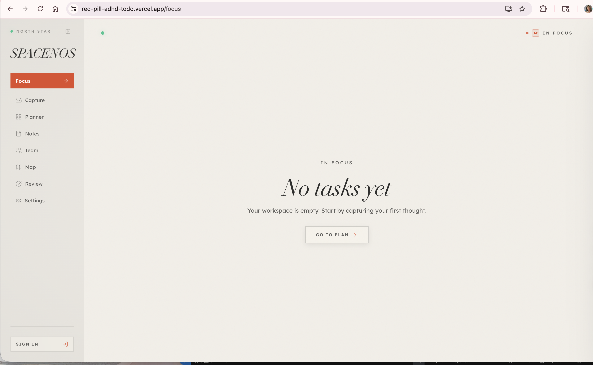
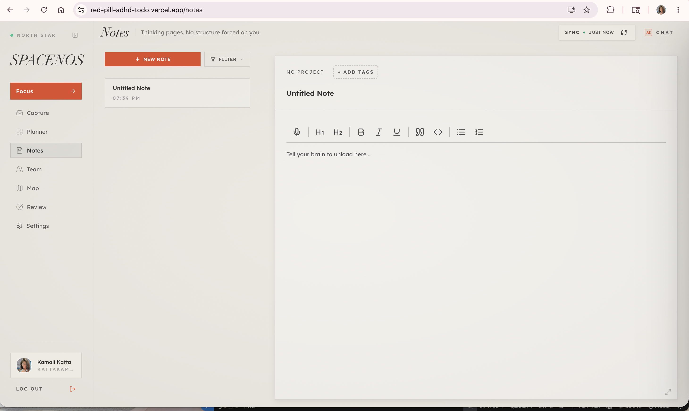
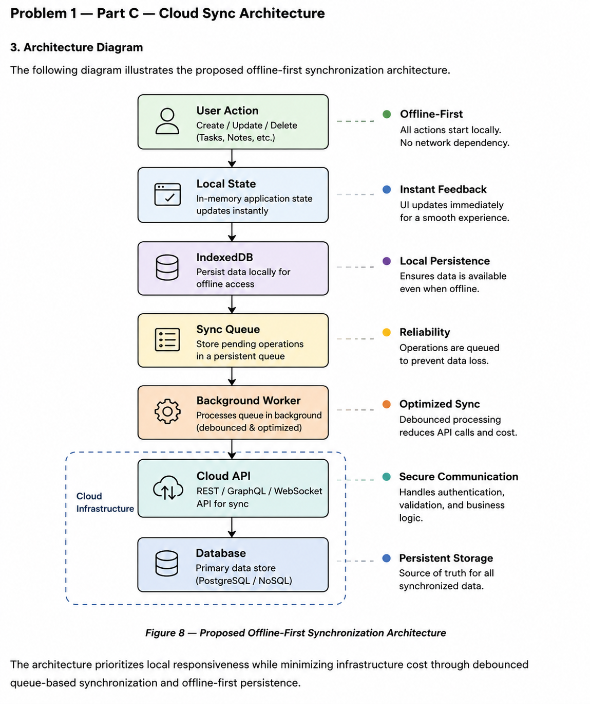

# Spacenos AI Product Engineering Assessment

AI-assisted product engineering assessment focused on:

- Offline-first architecture
- UX systems thinking
- AI-native workflows
- Scalable frontend architecture
- Motion systems
- Design systems
- Accessibility-first interfaces

---

# Overview

This assessment approaches frontend engineering from a production-oriented perspective rather than a purely theoretical one.

The submission includes:

- UX audit analysis
- AI prompt engineering workflows
- Offline-first sync architecture
- Design token system architecture
- Motion strategy planning
- Performance optimization thinking
- Scalable frontend system organization

---

# Core Concepts

## Offline-First Synchronization

Architecture includes:

- Local-first state management
- IndexedDB persistence
- Queue-based synchronization
- Background sync workers
- Conflict resolution strategy
- Debounced API synchronization

---

## Design System Architecture

Token hierarchy includes:

Primitive Tokens
→ Semantic Tokens
→ Component Tokens
→ Theme Layer
→ UI Components

---

## AI-Assisted Workflow

Tools used:

- Claude AI
- ChatGPT
- Excalidraw
- Overleaf
- Figma
- Tailwind CSS
- Framer Motion

AI was used as an engineering accelerator for:
- UX analysis
- architecture iteration
- prompt refinement
- technical validation

All final decisions were manually reviewed.

---

# Repository Structure

```bash
docs/           → assessment PDF + screenshots
prompts/        → AI workflow prompts
architecture/   → architecture notes
prototype/      → future implementation ideas
```

---

# Screenshots

## Dashboard Audit



## Notes Interface



---

# Architecture Diagram



---

# Key Engineering Principles

1. Local-first UX
2. Accessibility-first design
3. Scalable frontend systems
4. AI-assisted workflows
5. Performance-aware motion
6. Token-driven consistency
7. Maintainable architecture

---

# Author

Katta Kamali  
SRM University AP
